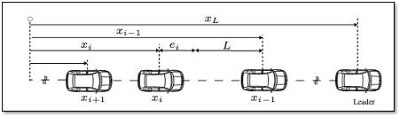
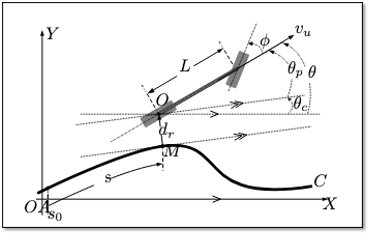
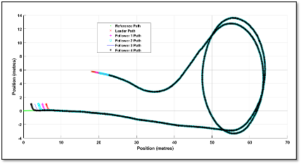

# Platoon control of autonomous vehicles
Control system design for platoon of autonomous vehicles

### Problem Description
Each car in the platoon maintains the longitudinal distance with the vehicle in front and follows the trajectory (lateral control) of the leader vehicle.

### Kinematic Model of the AV

### Example Results

## Features:
  1. Implements a hybrid controller between base leader and followers in a platoon of vehicles. 
  2. Robustness of the controller is tested by adding various perturbation.
  3. Trajectory data collected from real-world vehicle data. 
  4. Various constrollers explored: PID, Sliding mode controller and so on.
  
## Requirements:
1. MATLAB 2015 (or later)
2. Simulink libraries

## How to run:
1. run: `src/matlab/run_it.m`
2. run: `src/simulink/Platoon_Local_new_2015a.slx or Platoon_Global_new_2015a.slx or Platoon_Hybrid_new_2015a.slx`
3. run: `src/matlab/ResultsPlatoon.m`

## Acknowledgements
Project done in collaboration with Mr. Aman Sharma under the supervision of Prof. Philippe Martinet at Ecole Centrale de Nantes and LS2N.
